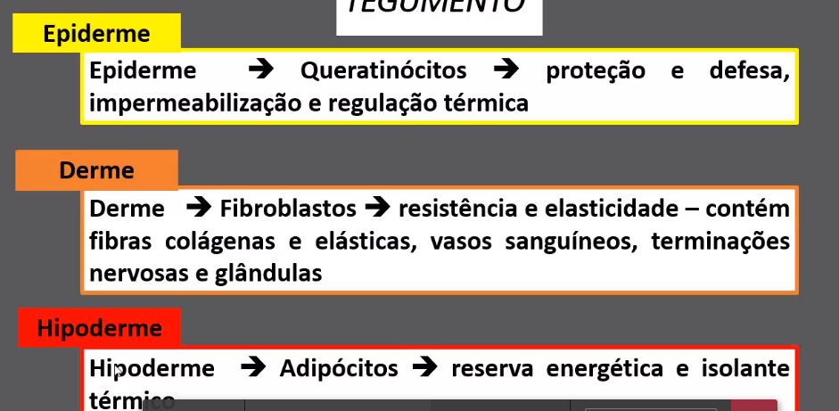

# Pele e anexos

## Funções:

- Barreira mecânica entre meio externo e interno
- Termorregulador
- Contem estruturas do corpo
- Sensibilidade
- Síntese de vitamina D
- Absorção
- Excreção

Em um mesmo indivíduo, a pele varia em função do local e da idade: Turgor, textura, etc.
A epiderme é a correspondente de camadas mais rígidas de outros animais (casco, carapaça, etc.).

## Constituição da pele:

### Epiderme

Epitélio queratinizado. Camada externa e avascular; firme e protetora. Formada por queratina: dura e resistente.

A vascularização vem da derme, que também manda dutos para a derme.

Pouco espessa, mas possui várias camadas:

- Camada externa: córnea 
- [Algumas outras; não caem]
- Camada interna: camada basal. Os **melanócitos** se encontram nessa camada.

A córnea se desgasta com o tempo, então a camada basal repõe-na. A cada 26 dias é totalmente reposta:

- 13 dias para o ciclo celular: tempo para progressão dos queratinócitos da camada basal para a camada córnea
- 13 dias para a desintegração da queratina

**Importante**

Vai da epiderme para a derme:

* Glândula sudoríparas
* folículo piloso
* terminações nervosas livres: participa do arco reflexo

-----

### Derme

Vascularizada por artérias, formando **plexo cutâneo de artérias**. Há vascularização diferenciada para diferentes partes do corpo. Exemlo: couro cabeludo é altamente vascularizado.

Possui terminações nervosas aferentes sensíveis a tato, dor, temperatura. Algumas penetram a epiderme, mas nem todas.

Possui várias elevações em direção à epiderme, o que origina as **papilas dérmicas**

Há presença de colágeno e fibras elásticas. Com o envelhecimento, o número dessas fibras vai diminuindo.

A pele é elástica só até certo ponto. Se ela se distende mais que isso, danifica as estruturas de elastina e fibrina, gerando estrias ou 

Alguns lasers estimulam mais produção das fibras -> tratamento estético.

A pele é elástica só até certo ponto -> estrias; resquício da bariátrica.

### Hipoderme

Camada gordurosa dotada de elasticidade.

Glândulas sudoríparas | Glândulas sebáceas

| Glândulas Sudoríparas                      | Glândulas Sebáceas                                           |
| ------------------------------------------ | ------------------------------------------------------------ |
| Abundante em palma das mãos e sola dos pés | Ausente nas palmas das mãos e sola dos pés. **Só existe onde há pelo** |
| Função: regular temperatura corporal       | Função: lubrificar pele e pelos                              |

----

Resumo:

## Queimaduras (importante)

- 1o grau: danifica somente epiderme. Vermelhidão (**hiperemia**/**eritema**) no local, além de dor (uma vez que as terminações nervosas livres chegam à epiderme).
- 2o grau: alguma parte da derme. Presença de bolha (**flictena**), bolsa líquida. Dolorosas, mas geralmente cicatrizam sem deixar marcas.
- 3o grau: envolve totalmente a derme, atingindo tecidos subjacentes (músculo, tendão, osso), Na teoria, não dói, já que destrói os neurônios da derme. Entretanto, os tecidos subjacentes também são enervados. Para tratar é preciso fazer enxertos de outros locais.
- 4o grau: destrói o membro. Carbonização de partes da derme, hipoderme e até de partes do tecido subjacente.

## Alterações comuns da pele:

* Vitiligo

* Albinismo

* Icterícia: acumulo de metabólitos na pele. Associado a danos hepáticos

* Cianose: Geralmente aparece nas extremidades e aponta irrigação insuficiente 

* Cicatrizes hipertróficas e quelóides: ocorrem quando fibras de elastina e colageno sofrem uma hiperexpressçao, o que leva à má cicatrização.

* **Melanomas**: Tumor malígno, já que pode facilmente alcançar a derme e cair na corrente sanguínea, sofrendo metástase. Caracterizadas por manchas 

* > Assimetria
  >
  > Bordas irregulares
  >
  > Coloração 
  >
  > Diâmetro
  >
  > Evolução

## Destaques

### Pelos:

A pele pode ser dividida em **pele pilosa** ou **pele glabra**

### Unhas

Apresentam uma borda, o corpo e a **lúnula**, que é a parte germinativa da unha.

### Mama

Uma série de ductos mamários que convergem nos mamilos. 

