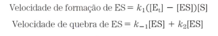
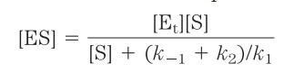

# Enzimas

12/08/20

---

Algumas enzimas precisam de um **cofator** para desempenhar seu papel no organismo, que pode ser íons, ou uma molécula orgânica, chamada de **coenzima**, geralmente derivadas de vitaminas. Se a coenzima ou o cofator se ligam muito firmemente à enzima são chamados **grupo prostético**.

Há um codigo que classifica as enzimas, no formato A.B.C.D. A é a classe da enzima, que pode ser:

1. Oxirdoredutases
2. Transferases
3. Hidrolases
4. Liases
5. Isomerases
6. Ligases

As enzimas atuam reduzindo a energia de aticação necessária para transformar os reagentes nos produtos, não sendo alterada ao fim do processo.

A velocidade de qualquer reação é dada por V = k • [A] • [B] ... Inerente ao k é a velocidade de ativação da reação. Assim, a relação do k da reação catalizada e o k da reação normal temos uma razão de quão mais eficientes são as reações caralizadas (em torno de 10^{10}). A constante de equilíbrio, entretanto, não se relaciona com enzimas.

O modelo mais aceitado atualmente diz que no estado de transição enzima e substratos estão em seus estados de maior complementariedade. 

## Análise qualitativa das enzimas

As enzimas só podem atuar enquanto estão em quantidade o suficiente concentração. Uma vez que todas estão preenchidas, não ocorre mais aumento na velocidade.

A reação catalizada ocorre em pelo menos duas etapas. A mais demorada é aquela com maior energia de ativação e sua constante de reação é *kcat*.

A reação catalizada entra num **estado estacionário** quando a concentração de um de seus intermediários não se altera, uma vez que a formação de novos intermediários ocorre no mesmo ritmo do consumo dessas substâncias. Nesse momento, as enzimas estão "saturadas", então aumentar a quantidade de substrato não aumenta a velocidade da reação.

Podemos descobrir a velocidade da reação total ao considerar que esta é a mesma da velocidade no estado estacionário. Considerando um equação do tipo
$$
\ce{E + S <=> ES <=> EP <=> E + P}
$$
na qual a passagem de ES para EP é a mais demorada, temos que ES será o intermediário cuja concentração não se alterará no estado estacionário. 

Vf = Vq. Simplificando, temos que

Definindo as constantes da equação como **constante de Michaelis (Km)**

$$
sendo\ K_m = (K_{-1} + K_2)/K_1\\
e\\
V_0 = k_2[ES],\\
temos\ que\\
V_0 = \frac{k_2[E_t][S]}{K_m + [S]}\\
$$

A velocidade máxima da reação ocorre quando toda a enzima está "saturada", sendo representada como k2[Et]. **Finalmente,**

$$
V_0 = \frac{V_{max}[S]}{K_m+[S]}
$$

Pela equação, quando a velocidade inicial é metade da velocidade máxima, a constante de Michaelis é igual a [S]. 

