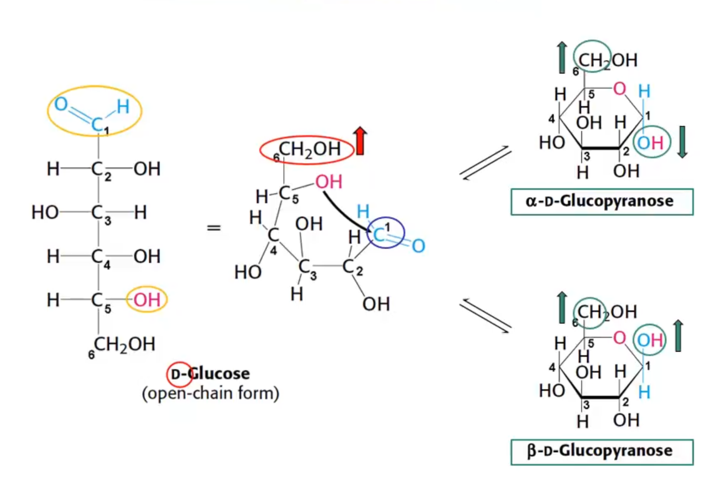

# Carboidratos

Vários carbonos são isomeros, mas cada um possue nome diferente. Só se usa D e L para representar em relação ao carbono mais distante do radical cetona. Moléculas epímeras só se distinguem em relação ao carbono especificado.

Vários carboidratos encontram-se ciclizados devido à maior estabilidade nessa forma.

Os grupos à **esquerda** ficam **para baixo**, enquanto os para **direita**, **para cima**. Nessa forma, acrescenta-se o radical -piranose no nome. Por último, a molécula pode assumir forma de **cadeira** (mais estável) ou forma de **barco**.

Glicídeos podem se ligar. No caso da maltose, o grupo hemiacetal se liga ao álcool do carbono 4 da molécula adjacente. Nesse caso, uma ponta hemiacetal permanece livre e, por isso, o açucar é chamado **redutor**.

