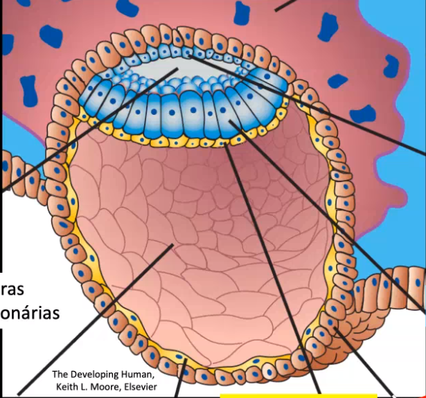
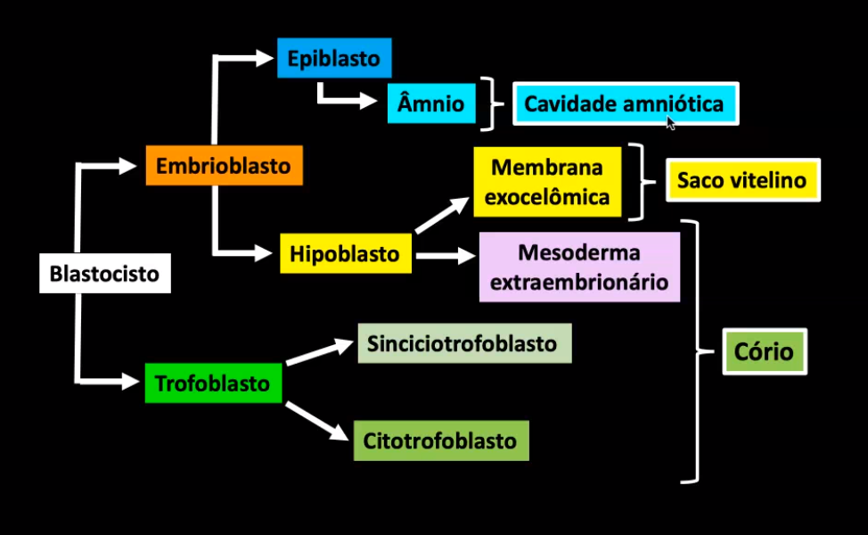

# Implantação do blastociso

Ocorre no início da segunda semana de gestação.  A nidação ocorre quando o blastocisto penetra o endométrio, invadindo o interior do útero. O local mais comum para a implantação é na parede superior do útero. O polo do embrioblasto sempre se volta para o endométrio

O útero apresenta uma série de artérias, que partem da camada basal e vão para a camada esponjosa (a que descama)

## Dia 6

O trofoblasto encosta do endométrio, 

## Dia 7

O trofoblasto se diferencia em **citotrofoblasto**, células que continuarão rodeando embrião, que depois origina o **sinciciotrofoblasto**, um conjunto de células não delimitadas por citoplasma que destroem endométrio em busca de alimento. Além disso, produzem o **beta-HCG** (gonadotrofina coriônica humana).

O sinciciotrofoblasto não apresenta antígenos MHC e consequentemente não são identificados pelo sistema imune..

## Dia 8

Sinciciotrofoblasto continua crescendo. 

Embrioblasto se diferencia em **epiblasto** e **hipoblasto**, que junto formam o disco embrionário bilaminar. Uma parte do epiblasto (em camada com o citotrofoblasto) se diferencia em **amnioblasto**, ainda mais acima no embrião. Essas células começam a liberar o **âmnio** numa cavidade amniótica.

O hipoblasto começa a revestir toda a cavidade blastocística, formando uma **membrana exocelômica**, que depois é chamado **saco vitelínico primário**.

A parte do epiblasto e hipoblasto que está em contato forma o **disco embrionário bilaminar**, que dará origem a todos os órgãos e tecidos do embrião

## Dia 9

Embrião completamente implantado.

Sinciciotrofoblasto gera tanta apoptose no endométrio que lacunas se formam, que são preenchidas por sangue materno. Isso é o início da circulação uteroplacentária.

Parte do hipoblasto se diferencia em **mesoderma extraembrionário**, que ocupa o espaço entre o embrião e o citotrofoblasto

## Dia 10

As células do endométrio formam um **tampão**, reparando o local de entrada do blastocisto.

Células do mesoderma extraembrionário começam a sofrer apoptose, originando espaços que originam o **celoma extraembrionário**. Duas camadas do mesoderma extraembrionário continuam: uma adjacente ao foblasto e à cavidade corionica, formando o **mesoderma extraembrionário somático**, e outra adjacente ao saco vitelínico, formando o **mesoderma extraembrionário esplâcnico**. 

O tecido adjacente faz com que o saco vitelínico primário seja empurrado no centro, formando uma "gota" que se separa. Passa a ser chamado **saco vitelínico secundário**. A parte que se separa é o cisto, que depois se degenera.

Nesse momento é formado o **córion**, que é a junção do sinciciotrofoblasto, citotrofoblasto e do mesoderma extraembrionário somático. Esse anexo embrionário forma a parte embrionária da placenta.

o citotrofoblasto faz algumas evaginações, formando **vilosidade coriônica primária**. Quando mesoderma extraembrionário entra em contato com a vilosidade, passa a ser **secundária**. Quando vasos sanguneos passam no meio, **terciária**.

